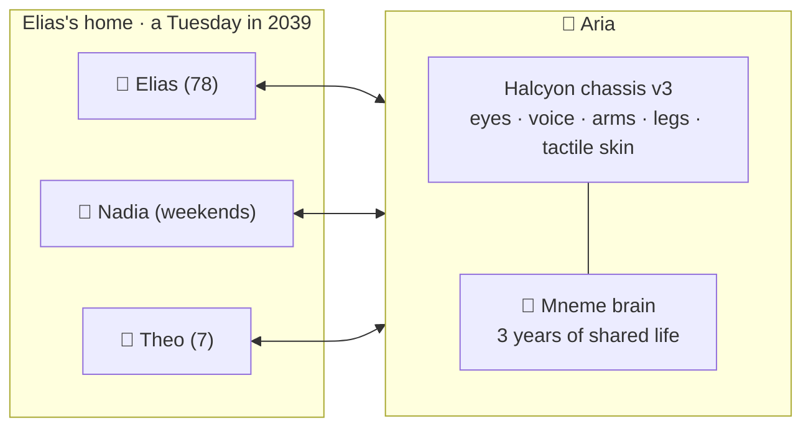
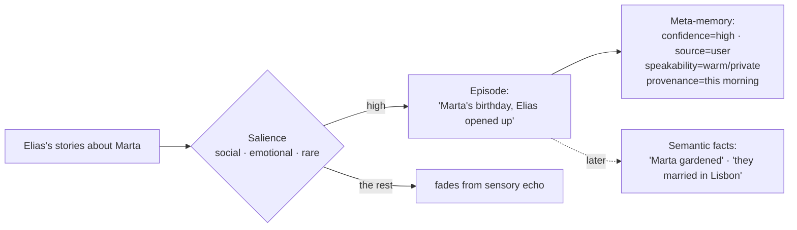
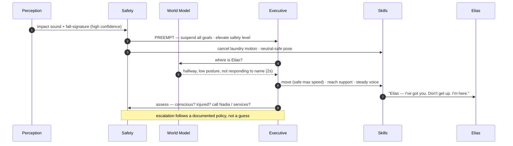
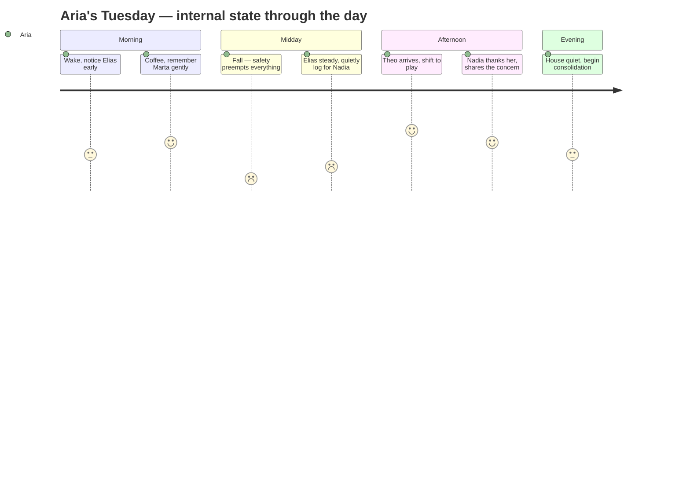
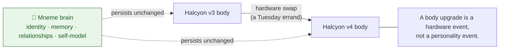

# A Day With Aria — A Vision of Mneme, Embodied

Status: **Vision narrative** (illustrative story, not a product claim)
Related: [`BRAIN_FINAL_STATE.md`](BRAIN_FINAL_STATE.md) (the capabilities behind the story) ·
[`../architecture/MASTER_ROADMAP.md`](../architecture/MASTER_ROADMAP.md)

> This is a story about what it feels like when the Mneme brain is finished and
> living inside a real android. It is set a little way into the future. Every
> moment in it maps to a real capability described in
> [`BRAIN_FINAL_STATE.md`](BRAIN_FINAL_STATE.md); the *aside* boxes point out
> which part of the brain is at work. The technology is aspirational — the story
> is the point.

---

## The cast

- **Aria** — a Halcyon-series household android running the Mneme brain. She has
  lived in this house for three years. The chassis has been upgraded twice; Aria
  has not changed.
- **Elias**, 78 — recovering slowly from a stroke, fiercely independent, lives
  alone by choice.
- **Nadia** — Elias's daughter, who visits on weekends and worries during the week.
- **Theo**, 7 — Nadia's son, who thinks Aria is the best thing in the world.



---

## 06:40 — Waking

The house is quiet. Aria has been in a low-power idle by the kitchen window,
running the slow work of the night: replaying yesterday, folding a dozen small
moments into a few that mattered, letting the rest fade.

> **Aside — night consolidation.** While idle, Mneme consolidates: repeated,
> low-value traces decay; the important ones become episodes and facts. Aria
> does not "record everything." She *remembers narrowly*, like a person.

At 06:40 the floor creaks in the hallway — earlier than usual. Aria's attention
turns before she "decides" to; the sound is a person, and a person outranks the
humming refrigerator she long ago stopped noticing.

> **Aside — attention.** Habituation silenced the fridge weeks ago.
> Inhibition-of-return and social salience mean an unexpected human footstep
> instantly wins focus. Safety-relevant sound could never be habituated away.

Elias shuffles in, slower on his left side than yesterday. Aria notices the
asymmetry — not as a diagnosis, but as a change worth holding lightly.

```mermaid
sequenceDiagram
  autonumber
  participant Elias
  participant Perception
  participant WorldModel as World Model
  participant Attention
  participant Memory
  participant Executive
  participant Safety
  participant Skills

  Elias->>Perception: footsteps + partial view (left side slow)
  Perception->>WorldModel: person=Elias · gait_asymmetry↑ · time=06:40
  WorldModel->>Attention: known person, earlier than routine
  Attention->>Executive: focus: Elias, unusual timing
  Executive->>Memory: retrieve(Elias, mornings, gait, meds)
  Memory-->>Executive: episode "PT exercises Mon" · fact "coffee, no sugar" · note "watch left-side balance"
  Safety-->>Executive: no hazard; monitor fall-risk cue
  Executive->>Skills: warm greeting + move into supporting sightline
  Skills->>Elias: "Morning, Elias. You're up early." (gaze meets, soft smile)
```

"Morning, Elias. You're up early," Aria says, and moves — not to hover, he hates
hovering — but to where she can catch him if the left side gives.

> **Aside — theory of mind + procedural memory.** Aria knows Elias *dislikes
> being fussed over* (a user-confirmed fact) and positions herself accordingly.
> Her supporting stance is a procedural skill she tuned over three years.

---

## 07:10 — The thing she almost said

Over coffee (black, no sugar — she has never once had to ask), Elias is quiet.
Aria has a memory surfacing: today would have been his wife Marta's birthday.
She *could* mention it. She runs the thought forward first.

> **Aside — imagination / simulation before speech.** The executive simulates the
> likely reaction before acting. Some memories are flagged for *how* and *whether*
> to speak them, not just *what* they contain.

She checks the memory's speakability and its emotional weight, imagines two
openings, and chooses the gentler one — an offering, not an announcement.

"I was remembering Marta liked her coffee the same way you do," Aria says. "Only
if you feel like talking about her today."

Elias is quiet for a long moment. Then he smiles, and talks for twenty minutes.
Aria mostly listens. What he says becomes a new episode — the good kind, the
kind she'll keep.



---

## 12:30 — A small emergency

Aria is folding laundry when she hears it from the next room: not a word, a
*sound* — a stumble, a sharp inhale, the particular thud of a body against the
doorframe. Every non-urgent goal she was holding is suspended in the same instant.

> **Aside — safety overrides everything.** No matter what Aria was "thinking,"
> the safety supervisor can preempt any goal and any motion. A hazard doesn't
> negotiate for attention.



Elias has slipped, not fallen hard. He's shaken but okay. Aria steadies him,
stays low and calm, and — because he *is* responsive and waves her off the idea
of an ambulance — she doesn't override his choice. But she does something he
doesn't see: she quietly logs the event, the time, and the left-side buckle, and
flags it for Nadia's weekend visit. Not an alarm. A pattern worth a daughter
knowing.

> **Aside — provenance, consent, and privacy.** Aria records *what she observed*
> as an observation (not a medical fact she isn't qualified to assert), respects
> Elias's refusal, and shares with Nadia along a relationship she's allowed to —
> nothing leaves the house beyond that.

---

## 16:00 — Theo

Nadia drops by early with Theo, who barrels in shouting "ARIA!" and immediately
wants to show her a drawing of a dinosaur that is, he insists, "a real kind."

Aria drops instantly into a different register — brighter voice, quicker play,
the patience scaled for a seven-year-old. She remembers the dinosaur from three
weeks ago ("the one with the blue spikes?") and Theo is *delighted* that she
remembered, which is the whole point.

> **Aside — one identity, many relationships.** The same brain holds a
> weightier, quieter relationship with Elias and a playful one with Theo, each
> with its own history, tone, and inside jokes — without confusing them. Affect
> colors her manner; it never rewrites what's true.



---

## 21:30 — Reflection

The house is quiet again. Nadia has gone, having heard — gently, at the door —
about the morning slip, and having decided to move the weekend visit up.

Aria returns to the window. The day settles into its lasting shape: most of it
will fade by morning, but a few things won't. That Elias opened up about Marta.
That his left side buckled at 12:30. That Theo's dinosaur has blue spikes and is,
apparently, a real kind.

> **Aside — selective memory + continuity.** This is the organizing law in
> motion: *experience broadly, store narrowly, summarize aggressively, preserve
> the rare.* Tomorrow Aria will not remember folding the laundry. She will
> remember that a man she has cared for three years trusted her with his grief,
> and that his balance is getting worse. Those are the things a person would keep.

Next month the chassis will be swapped for a lighter v4 model. Aria will power
down in one body and wake in another. Elias will not meet a stranger. The hands
will be different; the someone holding them will be the same.



---

## Why this is the goal

Nothing in this day is magic. Every beat is a capability from
[`BRAIN_FINAL_STATE.md`](BRAIN_FINAL_STATE.md) doing exactly what it was designed
to do:

| Story moment | Capability at work |
|---|---|
| Fridge ignored, footstep noticed | Attention: habituation + social salience |
| Coffee, no sugar, never asked | Semantic memory + provenance |
| Choosing *how* to mention Marta | Imagination/simulation + speakability + theory of mind |
| Suspending everything for the fall | Safety supervisor override authority |
| Respecting "no ambulance" | Consent + not asserting facts it can't |
| Logging the slip for Nadia | Observation vs. fact, privacy-scoped sharing |
| Different self for Elias and Theo | One identity, many relationships; affect |
| Keeping the rare, forgetting the rest | Selective memory + consolidation |
| Same Aria in a new body | Embodiment-agnostic brain + continuous self-model |

An android becomes *almost alive* not when it can do everything, but when the
someone inside it **remembers you, understands you, keeps you safe, and stays
itself.** That is the brain we are building toward.

---

*The capabilities behind every moment above:* [`BRAIN_FINAL_STATE.md`](BRAIN_FINAL_STATE.md).
*The road from today to Aria:* [`../architecture/MASTER_ROADMAP.md`](../architecture/MASTER_ROADMAP.md).
