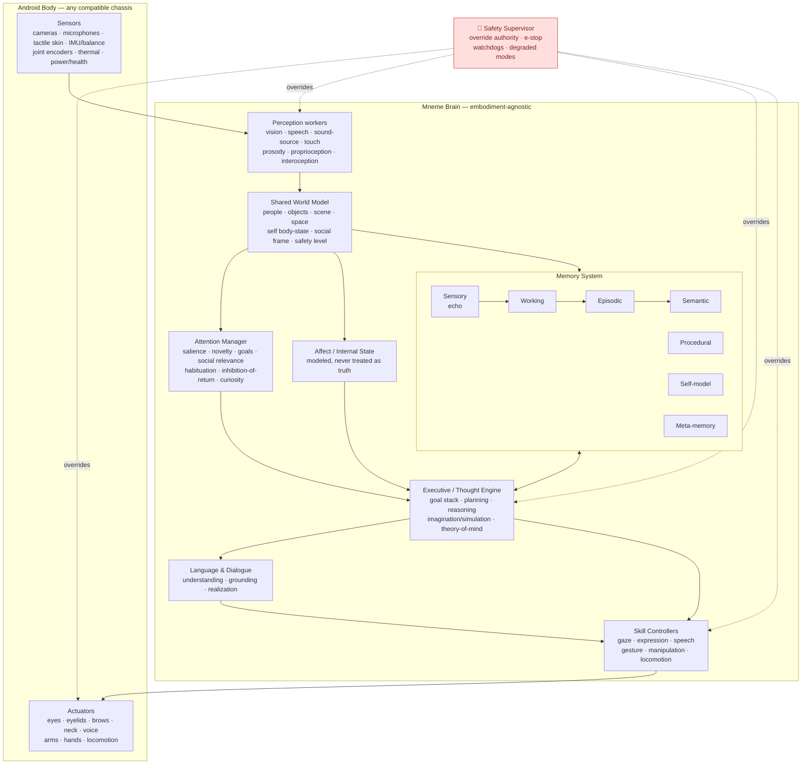
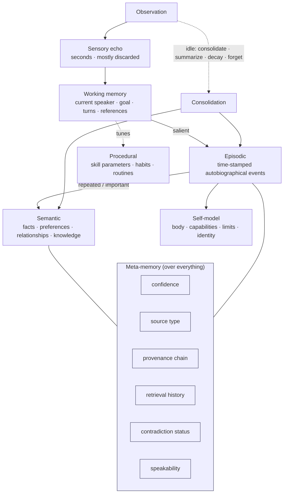
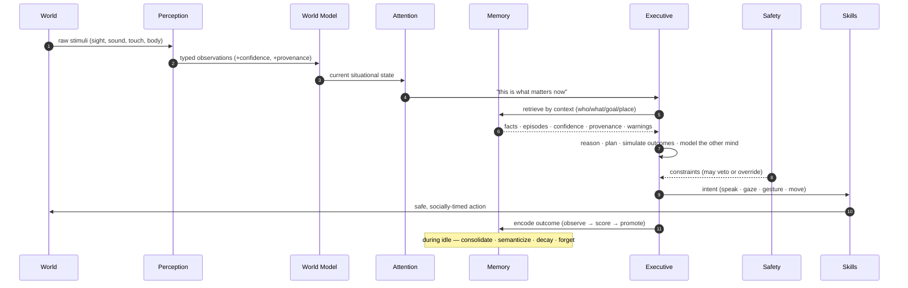
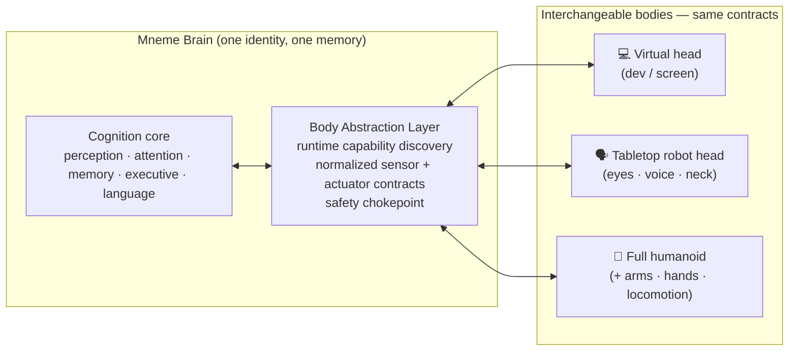
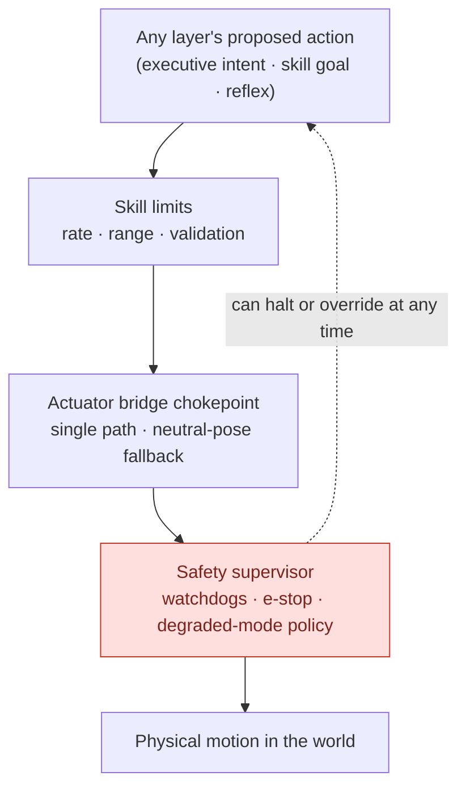
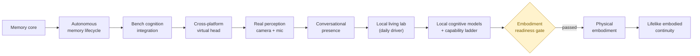

# The Mneme Brain — Final-State Specification

Status: **Vision / north-star specification** (aspirational end state, not current implementation)
Related: [`../architecture/MASTER_ROADMAP.md`](../architecture/MASTER_ROADMAP.md) (how we get there) ·
[`../DESIGN_DOCUMENT.md`](../DESIGN_DOCUMENT.md) (current design) ·
[`ANDROID_VISION_STORY.md`](ANDROID_VISION_STORY.md) (what it feels like in use)

> This document describes Mneme **as it is intended to exist when complete**: a
> full software brain — sensory, cognitive, and motor — that can be dropped into
> a compatible android body and make it feel *almost alive*. It defines the
> capabilities the brain will have and the requirements it must satisfy. It is a
> target to design toward, not a claim about what runs today. For what actually
> works now, see [`../status/REPO_STATUS.md`](../status/REPO_STATUS.md).

---

## 1. What "the final state" means

The end goal is a **complete, embodiment-agnostic cognitive system** — a brain,
not a chatbot — that:

- **perceives** the world through many parallel senses,
- **attends** to what matters based on goals, salience, and safety,
- **remembers** its life the way a person does: selectively, with compression,
  provenance, and forgetting,
- **thinks** — reasons, plans, imagines, and models other minds,
- **speaks and acts** through coordinated motor skills, and
- **continues** as a stable identity across days, months, and body upgrades,

all while remaining **safe, private, observable, and explainable**, and able to
be **integrated into future androids** through a stable body-abstraction contract.

The organizing law of the whole system is unchanged from the current design:

> **Experience broadly, store narrowly, summarize aggressively, preserve the
> rare, and retrieve by context** — and let *nothing* reach a motor without
> passing through intent arbitration and safety.

---

## 2. Design axioms (invariant at every scale)

These hold in the final state exactly as they hold in V1:

1. **Organized parallelism, not a serial loop.** Many workers observe → shared
   state is built → one executive arbitrates → many skills execute.
2. **Authority chain.** Workers publish observations · state builders publish
   state · executive publishes intent · skills publish actuator goals · the
   actuator bridge sends final commands · **safety can override any stage.**
3. **Memory never directly controls motors.** It provides context; the executive
   decides.
4. **Three truths are never collapsed:** raw observation ≠ inference ≠ confirmed
   fact. Everything carries source type, confidence, and provenance.
5. **Determinism first.** Every capability ships deterministic and testable
   before any learned or model-driven variant is allowed behind it.
6. **Safety and privacy are hard boundaries,** not features to be traded off.
7. **Local-first.** The brain runs on-device; the cloud is never a hard
   dependency for core cognition.

---

## 3. The human parallel

Mneme is explicitly modeled on human cognitive architecture. Each faculty maps
to a subsystem and a rough neural analog:

| Human faculty | Mneme subsystem | Rough biological analog |
|---|---|---|
| Senses (sight, hearing, touch, balance, interoception) | Perception workers | Sensory cortices, thalamus |
| "What's out there right now" | Shared World Model | Association cortex / situational model |
| Focus & filtering | Attention Manager | Fronto-parietal attention networks, superior colliculus |
| Split-second memory | Sensory echo + Working memory | Iconic/echoic memory, prefrontal working memory |
| Life events | Episodic memory | Hippocampus → neocortical consolidation |
| Facts & knowledge | Semantic memory | Distributed neocortex |
| Skills & habits | Procedural memory | Basal ganglia, cerebellum |
| Sense of self | Self-model | Default mode network, insula |
| Knowing what you know | Meta-memory | Metacognitive prefrontal circuits |
| Deciding & planning | Executive / thought engine | Prefrontal cortex |
| Feeling states | Affect / internal state | Limbic system, amygdala, insula |
| Speaking & understanding | Language & dialogue | Broca's / Wernicke's areas |
| Moving & expressing | Skill controllers | Motor cortex, cerebellum |
| Not dying | Safety supervisor | Brainstem reflexes, protective reflex arcs |

---

## 4. Whole-brain architecture

**Read it as a flow of authority:** stimuli become observations, observations
become shared state, attention narrows that state, the executive decides using
memory and affect as *advisors*, and only the executive's intent — filtered by
safety — ever becomes motion.

---

## 5. Capability catalog

Each capability below is stated with the **requirements it must satisfy** in the
final state.

### 5.1 Perception (multimodal sensing)

- **Vision:** faces, people, objects, gestures, gaze direction of others, scene
  layout, reading text, low-light robustness.
- **Audition:** speech-to-text, speaker identification, sound-source direction,
  prosody/tone, non-speech sound events (a door, a fall, a name called out).
- **Touch:** contact location, pressure, texture, and social touch (a hand on
  the shoulder) across a tactile skin.
- **Proprioception:** joint positions, pose, and motion of its own body.
- **Interoception:** internal "body state" — temperature, power/battery, motor
  strain, latency, fault signals.
- **Spatial:** where it is, where things are, and a persistent map of familiar
  places.

**Requirements:** every observation carries timestamp, source device, and
confidence; perception workers **never** command motors; discovery of available
sensors happens at runtime (any body, any sensor set); raw streams are bounded
and hygienic; missing or failed sensors degrade gracefully, never crash.

### 5.2 Attention

Selects what to focus sensor, memory, and motor resources on. Handles
**habituation** (ignoring the unchanging), **inhibition-of-return** (not
re-fixating what was just handled), **social salience** (a person speaking to it
outranks background), **goal relevance**, and **curiosity** during idle time —
but is always **safety-immune** (a hazard captures attention regardless).

**Requirements:** attention decisions are explainable and bounded; safety-related
stimuli cannot be habituated away.

### 5.3 Shared world model

A single, queryable, time-decaying picture of the present: who is here, who is
speaking, what objects and hazards exist, the social situation, its own body
state, and the current safety level.

**Requirements:** every downstream layer reads the *same* world model; state
carries validity windows (TTL) so stale beliefs expire; snapshot-testable.

### 5.4 Memory (the heart of the system)

The full seven-layer human-inspired memory, at maturity:

- **Sensory echo:** very recent raw traces, mostly never promoted.
- **Working memory:** the active context window around an interaction.
- **Episodic:** autobiographical events — first meetings, surprises, errors and
  recoveries, promises made, high-salience social moments.
- **Semantic:** generalized facts, preferences, identities, relationships, and
  world knowledge, cleaner than episodes.
- **Procedural:** how-to behavior and skill parameters (gaze timing, greeting
  routines, safe-motion profiles), versioned with provenance.
- **Self-model:** the brain's memory of its own body, capabilities, limits, and
  continuous identity.
- **Meta-memory:** memory *about* memory — confidence, source type, provenance,
  retrieval count, contradiction status, and whether something is safe to say
  aloud.

**Lifecycle:** `observe → buffer → score (salience) → promote → consolidate →
semanticize → retrieve → decay/suppress/forget`, running autonomously.

**Requirements:** selective (never "store everything forever"); provenance- and
confidence-aware; conflicts are **marked, never silently overwritten**;
user-confirmed facts outrank inferences; forgetting is staged (down-rank →
suppress → purge) and reversible until purge; retrieval is cue-based and returns
ranking explanations; **nothing marked `never_say`/`internal_only` is ever
spoken.**

### 5.5 Cognition — executive and thought engine

- **Goal management:** a goal stack with safety-driven suspension and resumption.
- **Reasoning & planning:** multi-step plans toward goals, with fallback.
- **Imagination / simulation:** internally simulating outcomes ("if I say this,
  how will they react?", "what happens if I set this cup here?") before acting.
- **Theory of mind:** modeling what others know, want, and believe — including
  what *it* has told them before.
- **Decision arbitration:** turning attention + memory + affect + goals into a
  single **intent**, with safety having final say.

**Requirements:** every intent is traceable to its inputs; memory used in a
decision is cited (IDs + provenance); the model layer may *word* a response but
may never bypass retrieval, intent, or safety; deterministic fallback exists for
every model-driven step.

### 5.6 Language and communication

Natural, grounded, continuous conversation: understanding intent and reference,
grounding replies in actual memory, phrasing according to certainty ("you told
me…" vs. "I think…" vs. "I may be wrong…"), turn-taking, barge-in handling, and
multilingual capability.

**Requirements:** utterances never reference non-speakable memory; the brain can
always explain *why* it said something and *what it remembers*.

### 5.7 Affect and internal state

A modeled emotional/affective state (comfort, curiosity, concern, social warmth,
stress from fault or overload) that colors attention, expression, and dialogue
tone — and gives the android emotional *continuity*.

**Requirements:** affect is **modeled, never treated as ground truth** about
others; detected human emotion is a cue, not a fact; affect influences behavior
but never overrides safety or fabricates memory.

### 5.8 Motor and embodiment

Coordinated skill controllers for **gaze**, **eyelids/brows/facial expression**,
**neck/head pose**, **voice/speech**, **gesture**, **manipulation** (arms/hands),
and **locomotion** — expressive, socially timed, and physically safe.

**Requirements:** all motor output passes through the **actuator bridge
chokepoint** with rate limits, range limits, validation, and neutral-pose
fallback; the same virtual-skill contracts drive both a screen avatar and
physical actuators; e-stop halts motion end-to-end.

### 5.9 Learning and adaptation

Bounded, transparent learning: it tunes timing, gaze dwell, response delay,
salience thresholds, and retrieval preferences **within documented ranges**;
learns people, preferences, and routines over time; improves skills through
versioned procedural memory.

**Requirements:** no unrestricted self-modification; learned/model-generated
memory stays `model_inferred` until user-confirmed; every parameter change
carries provenance, version history, and **rollback**.

### 5.10 Self-model, metacognition, and continuity

Knows its own body and limits ("my left hand actuator is weak in cold"), knows
what it knows and how sure it is, and maintains a **single continuous identity**
across sessions, days, and even body upgrades.

**Requirements:** identity and relationships survive restarts and hardware
changes; the brain can introspect and report its own state and confidence.

---

## 6. Cross-cutting requirements (non-functional)

| Requirement | The brain must… |
|---|---|
| **Safety** | Give a safety supervisor override authority over every layer; support e-stop, watchdogs, and degraded modes; never let memory or a model drive an actuator directly. |
| **Privacy & consent** | Keep person data, transcripts, and embeddings under documented retention and speakability policy; keep secrets out of provenance; never send data off-device without explicit design and consent. |
| **Determinism & testability** | Ship every capability with deterministic behavior and replayable scenario tests before any learned variant; keep a green regression harness at all times. |
| **Performance** | Meet conversational and reflex latency budgets (perception→attention target < 100 ms; reflex/safety faster); measured, not assumed. |
| **Observability & explainability** | Emit a traceable event for every state change; explain any decision, utterance, or memory on request. |
| **Continuity** | Persist identity, relationships, and self-model across restarts and body changes. |
| **Embodiment-agnostic integration** | Plug into any compatible body through a stable body-abstraction contract with runtime capability discovery. |
| **Resource discipline** | Run core cognition on-device with a lightweight base; heavier senses/models are optional, isolated extras. |

---

## 7. The cognitive loop

The moment-to-moment cycle every waking instant:

---

## 8. Integration into future androids

The brain is deliberately **separate from the body**. Any compatible android
plugs in through a **Body Abstraction Layer** that discovers what sensors and
actuators the chassis offers at runtime and exposes them as normalized, typed
contracts. The same brain, memory, and identity move from a screen avatar to a
tabletop head to a full humanoid without cognition changes.

**Requirement:** a body upgrade is a *hardware* event, not a *personality* event.
The android that wakes up in a new body is the same "someone."

---

## 9. Safety is the outermost layer

No matter which layer produces an action, it is filtered on the way to the world:

---

## 10. Capability maturity ladder

The final state is reached by climbing an explicit ladder, benchmarked against an
animal-reference progression before claiming human-comparable function. Physical
embodiment stays gated behind a readiness gate — the brain loop must prove itself
first.

---

## 11. What the final brain will *never* do

Even complete, Mneme deliberately excludes:

- Unrestricted self-modification or uncontrolled procedural learning.
- Treating detected emotion as objective truth.
- Direct LLM/model-to-actuator control (a model may *word*, never *drive*).
- Permanent storage of everything, or storage without provenance.
- A hard cloud dependency for core cognition.
- Any physical actuation without simulation/dry-run and safety proof first.
- Memory that silently overwrites, or speaks what it was told to keep private.

These are not limitations to be lifted later — they are what make an
"almost-alive" android **trustworthy** enough to live alongside people.

---

*This is the destination. The path is in* [`../architecture/MASTER_ROADMAP.md`](../architecture/MASTER_ROADMAP.md)*;
the feeling of arriving is in* [`ANDROID_VISION_STORY.md`](ANDROID_VISION_STORY.md)*.*
